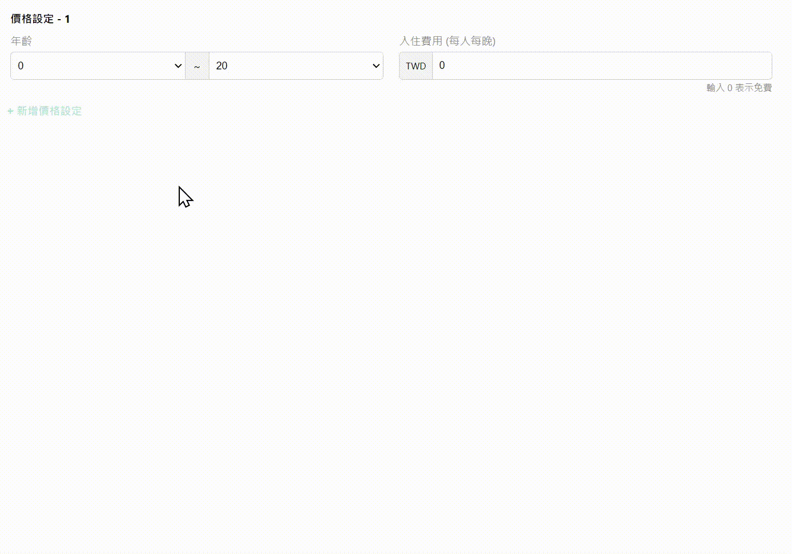

# Getting Started with Create React App

This project was bootstrapped with [Create React App](https://github.com/facebook/create-react-app).

## Available Scripts

In the project directory, you can run:

### `npm install`

You should run this script first to install all npm packages.

### `npm start`

Runs the app in the development mode.\
Open [http://localhost:3000](http://localhost:3000) to view it in your browser.

## Demo

- [x] 不同組年齡的 AgeGroupSelect 重疊有顯示錯誤提示
- [x] 空白的 PriceInput 有顯示錯誤提示
- [x] 當所有年齡範圍已經包含 0 到 20 歲時，新增價格設定需要 disabled
- [x] 入住費用顯示千分位，包含小數點的輸入與顯示 (目前設置為 onBlur 後自動轉換)
